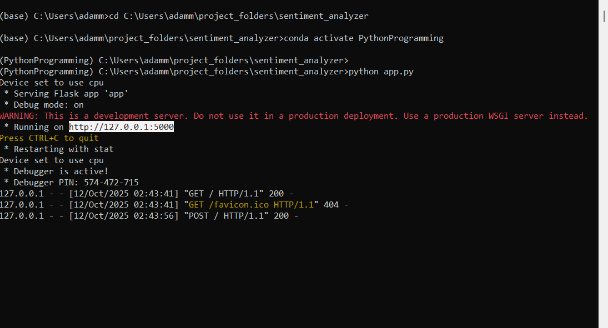
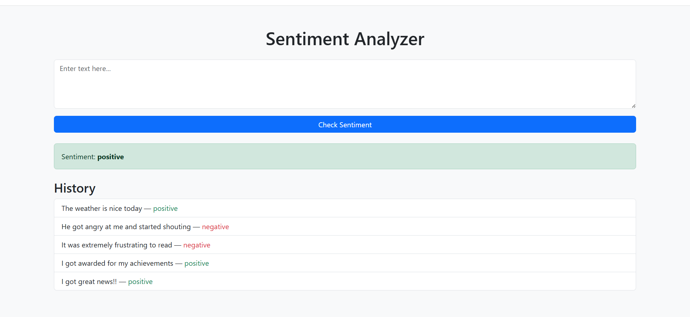

# Sentiment Analyzer

A simple web app built with Flask and Hugging Face Transformers that analyzes the sentiment of user entered text as positive or negative. Shows instant feedback and keeps history of previous analyses.

---

## ⚙️ Requirements

- Python 3.10 or higher
- Dependencies - all required packages are listed in `requirements.txt`

## 🚀 Features

- Enter or paste text to check sentiment
- Immediate feedback with color coding
- History of last 10 analyses
- Clean, responsive UI with Bootstrap

---

## 🛠️ Tech Stack

- Python - Core programming language
- Flask - Lightweight Python web framework
- Hugging Face Transformers - Pre-trained sentiment model
- Bootstrap - Responsive UI styling

---

## 📦 Installation

1. Clone this repository or click the green **Code** button, then select **Download ZIP** to download the repository

2. Extract the zip file to a folder on your computer

3. Create a `.env` file in the project folder and write your own secret key in the file:
SECRET_KEY=your_secret_key_here

    The secret key can be a combination of letters and numbers

4. Open Terminal (macOS/Linux) or Command Prompt/Anaconda Prompt (Windows)

5. Navigate to the folder:
`cd path/to/project`

6. Install dependencies:

`pip install -r requirements.txt`

7. Run the app:

`python app.py`

By default, the app will open at:  
[http://localhost:5000](http://localhost:5000)

---

## 📷 Screenshots

---

## 📖 What I Learned

- How to build a simple web app in Flask for NLP task that can be run locally in browser
- Using third party libraries/packages and including the dependencies in requirements.txt
- Loading a model from transformers HuggingFace library
- Basics of modular programming

## 📄 License

This project is licensed under the [MIT License](/LICENSE).

---

## 📌 Notes

- The Hugging Face model will download on first run
- The app does not have **neutral** label for sentiment, only negative/positive labels, as that would require a larger model
